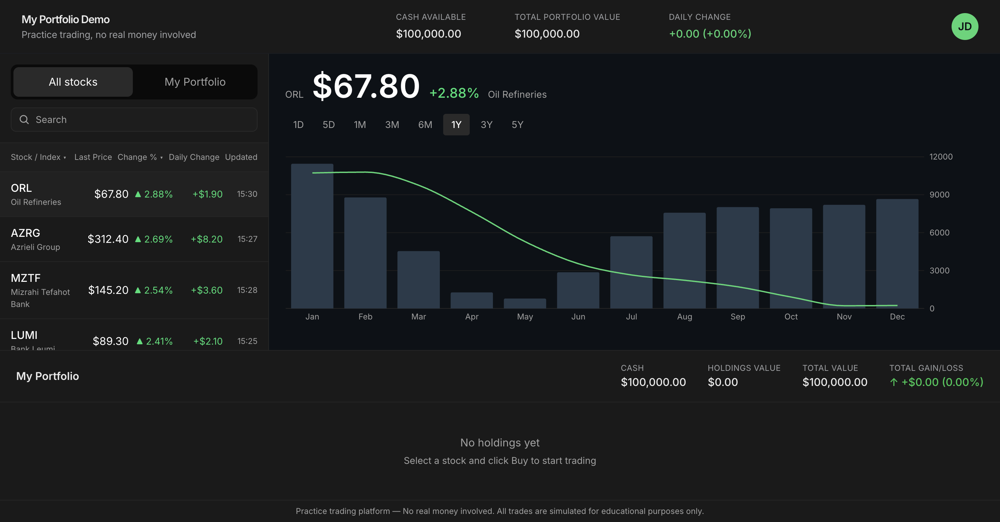
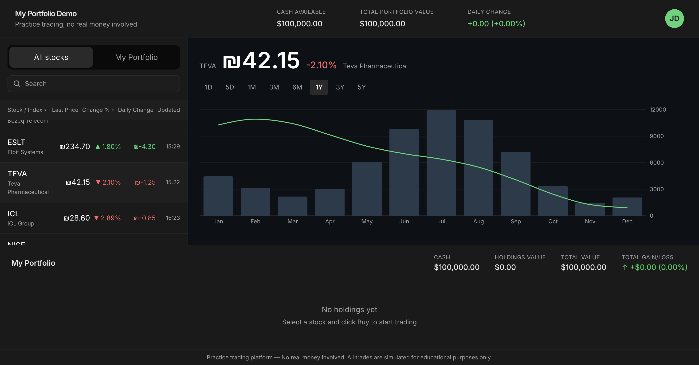
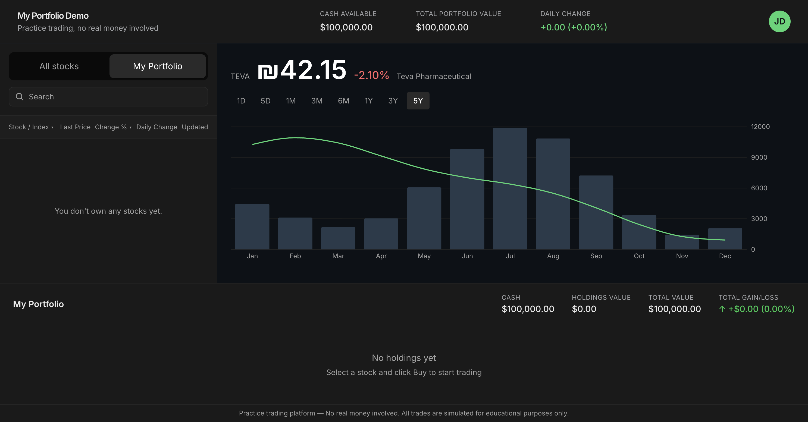
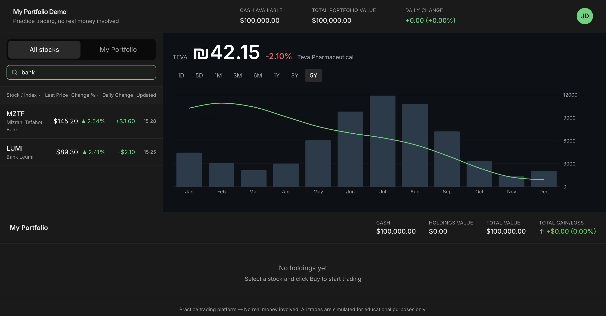

# Become a Builder in One Day — 2026

A simulated stock-trading dashboard built in a workshop, going from a Figma design to a running React app.

**Stack:** Vite + React 19 + TypeScript + Tailwind CSS v4 + Recharts.

This guide walks you from a brand-new laptop all the way to running the project, making changes with Claude Code, and opening your first pull request. No prior coding experience required.

---

## Screenshots

**Default view** — a stock with a positive daily change, 1-year volume bars and price trend line:



**Stock with a loss** — selecting a different ticker updates the chart and shows the change in red:



**Different time period** — period selector (1D / 5D / 1M / 3M / 6M / 1Y / 3Y / 5Y):


**My Portfolio (empty state)** — before any trades, the sidebar tab and bottom dock both show an empty state:



**Search filtering** — typing in the search box filters the stock list live:



---

## Table of contents

1. [Prerequisites — set up your machine](#1-prerequisites--set-up-your-machine)
2. [Get the project on your machine](#2-get-the-project-on-your-machine)
3. [Run the project](#3-run-the-project)
4. [Project structure](#4-project-structure)
5. [How to contribute (with Claude Code)](#5-how-to-contribute-with-claude-code)
6. [Testing your changes locally](#6-testing-your-changes-locally)
7. [Opening a pull request](#7-opening-a-pull-request)
8. [Troubleshooting](#8-troubleshooting)

---

## 1. Prerequisites — set up your machine

You need **four** things installed:

| Tool | What it is | Why |
| --- | --- | --- |
| **Node.js** (v20+) | The JavaScript runtime | Required to run the app |
| **Git** | Version control | Download the project, save your changes |
| **GitHub account** | Where the code lives | Submit changes, collaborate |
| **VS Code** (recommended) | Code editor | Edit files |
| **Claude Code** (recommended) | AI coding assistant | Make changes by chatting |

### 1.1 Install Node.js

> Node.js is what runs the app. Install version 20 or newer.

#### macOS

1. Open **Terminal** (press `Cmd + Space`, type "Terminal", hit Enter).
2. Install Homebrew if you don't have it (it's the standard Mac package manager):
   ```bash
   /bin/bash -c "$(curl -fsSL https://raw.githubusercontent.com/Homebrew/install/HEAD/install.sh)"
   ```
   Follow the on-screen instructions. When it finishes, it may print a "Next steps" section with two commands to run — copy and run both.
3. Install Node:
   ```bash
   brew install node
   ```
4. Verify:
   ```bash
   node --version
   npm --version
   ```
   You should see something like `v22.x.x` and `10.x.x`.

#### Windows

1. Go to [https://nodejs.org](https://nodejs.org) and click the **LTS** download button.
2. Run the installer. Accept all defaults.
3. Open **PowerShell** (press `Win`, type "PowerShell", hit Enter).
4. Verify:
   ```powershell
   node --version
   npm --version
   ```

### 1.2 Install Git

#### macOS

```bash
brew install git
```

Verify:
```bash
git --version
```

#### Windows

1. Download from [https://git-scm.com/download/win](https://git-scm.com/download/win).
2. Run the installer. Accept all defaults — but on the screen labeled **"Adjusting your PATH environment"**, choose **"Git from the command line and also from 3rd-party software"**.
3. Open **PowerShell** and verify:
   ```powershell
   git --version
   ```

After installing, configure your name and email (one-time setup):
```bash
git config --global user.name "Your Name"
git config --global user.email "you@example.com"
```

### 1.3 Create a GitHub account & sign in

1. Go to [https://github.com/signup](https://github.com/signup) and create an account.
2. Install the **GitHub CLI** so you can push code without juggling passwords:
   - **macOS:** `brew install gh`
   - **Windows:** Download from [https://cli.github.com/](https://cli.github.com/) and run the installer.
3. Sign in:
   ```bash
   gh auth login
   ```
   Choose **GitHub.com** → **HTTPS** → **Yes** (authenticate Git) → **Login with a web browser**. Follow the prompts.

### 1.4 Install VS Code (recommended)

Download from [https://code.visualstudio.com/](https://code.visualstudio.com/) and run the installer. Accept defaults.

### 1.5 Install Claude Code (recommended)

Claude Code is the AI coding assistant we'll use to make changes.

```bash
npm install -g @anthropic-ai/claude-code
```

Verify:
```bash
claude --version
```

When you first run `claude` in a project, it will guide you through signing in.

---

## 2. Get the project on your machine

1. Pick a folder where you keep code. For example:
   - **macOS:** `~/projects`
   - **Windows:** `C:\Users\<you>\projects`

   Create it if it doesn't exist:
   ```bash
   # macOS
   mkdir -p ~/projects && cd ~/projects

   # Windows (PowerShell)
   mkdir $HOME\projects -Force; cd $HOME\projects
   ```

2. Clone the project:
   ```bash
   git clone https://github.com/hadarge/become-a-builder-in-one-day-2026.git
   cd become-a-builder-in-one-day-2026
   ```

3. Open it in VS Code:
   ```bash
   code .
   ```
   (If `code` isn't found, open VS Code first → `Cmd/Ctrl + Shift + P` → type "Shell Command: Install 'code' command in PATH" → run it. Then try again.)

---

## 3. Run the project

From inside the project folder:

1. Install the project's dependencies (one-time, takes ~30 seconds):
   ```bash
   npm install
   ```

2. Start the dev server:
   ```bash
   npm run dev
   ```

3. You'll see output like:
   ```
   ➜  Local:   http://localhost:5173/
   ```
   Open that URL in your browser. You should see the trading dashboard.

4. To stop the server, press `Ctrl + C` in the terminal.

The dev server **hot-reloads** — when you save a file, the browser updates instantly. Keep it running while you work.

---

## 4. Project structure

```
src/
  App.tsx                    top-level layout
  main.tsx                   app entry point
  index.css                  global styles + Tailwind import
  types.ts                   shared TypeScript types
  data/
    stocks.ts                mock stock list + chart history
  components/
    Header.tsx               title, summary cards, JD avatar
    StockList.tsx            sidebar: tabs, search, sortable rows
    StockDetail.tsx          selected stock + bar/line chart + period selector
    PortfolioDock.tsx        bottom dock with portfolio summary
    Footer.tsx               disclaimer
```

No backend, no router, no state library — it's a single page powered by mock data in `src/data/stocks.ts`.

---

## 5. How to contribute (with Claude Code)

The workflow for any change — adding a feature, fixing a bug, tweaking styles — is the same:

```
branch  →  change  →  test  →  commit  →  push  →  PR
```

### Step 1 — Create a branch

A branch is a safe sandbox for your changes. Never work directly on `main`.

```bash
git checkout main
git pull
git checkout -b your-name/short-description
```

Examples: `alex/add-buy-button`, `sam/fix-chart-colors`.

### Step 2 — Make your change with Claude Code

From the project folder:

```bash
claude
```

This drops you into an interactive session. Type what you want in plain English. Examples:

- *"Add a 'Buy' button to the StockDetail panel that shows an alert with the stock ticker."*
- *"Change the gain color from green to teal across the whole app."*
- *"In the StockList sidebar, sort the rows by daily change percent (descending)."*

Claude will read the relevant files, make edits, and explain what it did. **Always read what it changed** — don't just accept blindly. If something looks wrong, say so:

- *"That's not what I meant — I want it on the row, not the header."*
- *"Undo the change to Header.tsx, only touch StockList.tsx."*

To exit Claude Code, type `/exit` or press `Ctrl + C` twice.

### Step 3 — Test locally (next section)

### Step 4 — Commit your changes

```bash
git status                          # see what changed
git add .                           # stage all changes
git commit -m "Add Buy button to stock detail"
```

A good commit message describes **what** you did in one line, present-tense.

### Step 5 — Push to GitHub

```bash
git push -u origin your-name/short-description
```

(After the first push, just `git push` works.)

### Step 6 — Open a PR (next section)

---

## 6. Testing your changes locally

Before opening a PR, **always** verify your change works in the browser.

1. Make sure the dev server is running:
   ```bash
   npm run dev
   ```

2. Open the URL it prints (e.g. `http://localhost:5173/`).

3. Click through the feature you changed. Check:
   - Does the new behavior work?
   - Did you accidentally break something else? Click around the whole app.
   - Does it look right? Compare to the Figma design if relevant.

4. Open the browser **DevTools console** (`F12` → "Console" tab). Look for red errors. If you see any related to your change, fix them before submitting.

5. Make sure the build succeeds:
   ```bash
   npm run build
   ```
   If this fails, your change has a TypeScript or build error — fix it before opening a PR.

---

## 7. Opening a pull request

A pull request (PR) is how you propose your branch's changes get merged into `main`.

### Easiest way — via GitHub CLI

After you've pushed your branch:

```bash
gh pr create --web
```

This opens your browser at a pre-filled PR form. Fill in:

- **Title:** short summary, e.g. *"Add Buy button to stock detail"*
- **Description:** what you changed and why, plus a quick "how to test" so reviewers can try it

Click **Create pull request**.

### Alternative — via the GitHub website

1. Go to https://github.com/hadarge/become-a-builder-in-one-day-2026
2. You'll see a yellow banner with your branch and a **"Compare & pull request"** button. Click it.
3. Fill in title + description, click **Create pull request**.

### After opening the PR

- Wait for a review.
- If reviewers leave comments, address them: pull up Claude Code again, make the edits, then:
  ```bash
  git add .
  git commit -m "Address review feedback"
  git push
  ```
  The PR updates automatically.
- Once approved, click **Merge pull request** on GitHub. Done.

---

## 8. Troubleshooting

### `npm install` fails

- Make sure Node is v20 or newer: `node --version`.
- Delete `node_modules` and `package-lock.json`, then try again:
  ```bash
  rm -rf node_modules package-lock.json   # macOS
  Remove-Item -Recurse -Force node_modules, package-lock.json   # Windows
  npm install
  ```

### `npm run dev` says "port in use"

Vite will automatically pick the next free port (5174, 5175...). Just use the URL it prints.

### Browser shows a blank page

- Open DevTools (`F12`) → "Console" tab. Read the error.
- Most common cause: a syntax error in a recent edit. Look at the file mentioned in the error.

### `git push` rejected

Someone else updated `main` while you were working. Pull and merge:
```bash
git pull origin main
# resolve any conflicts, then:
git push
```

### Claude Code can't find files

Run `claude` from the **project root** (the folder with `package.json`), not from a subdirectory.

### Still stuck?

Open an issue at https://github.com/hadarge/become-a-builder-in-one-day-2026/issues with:
- What you were trying to do
- What command you ran
- The full error message
